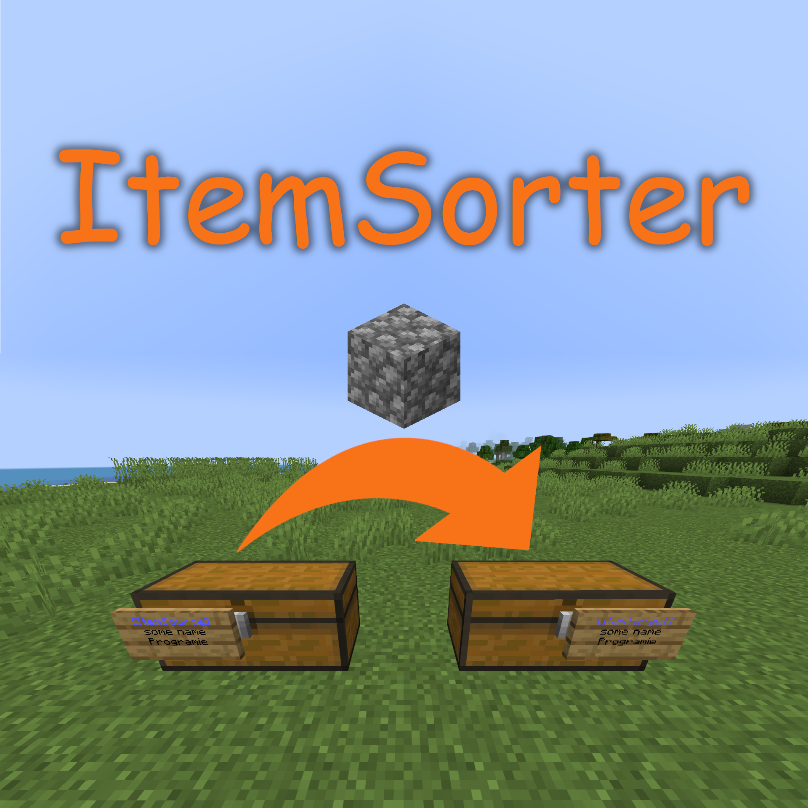

# ItemSorter

A Minecraft Bukkit plugin which transfers and sorts items from inventories like chests into other inventories.

## What is it?

ItemSorter allows players to automatically sort items from a chest (or any other inventory block like hoppers) into any number of target chests (or any other inventory blocks like barrels).

When transferring the items from the source chest into the target chests, the plugin takes a look of already existing items in the target chests and moves items into the chest already containing the specific item type.

## Permissions

* `itemsorter.create` - Allow to create and destroy signs (Default: everyone)
* `itemsorter.*` - Allow access to all features (Default: op)

## How to use it?

Simply place a sign at the side of any inventory block (chest, barrel, hopper, etc.) you would like to use as the source chest containing the following content:

* First line: `[ItemSorter]`
* Second line: `SOURCE`
* Third line: Any unique name used by the other connected chests

This will define the chest as an item source (i.e. the chest you will throw in your items for the plugin to sort them for you).

After that, place a sign at the side of any inventory block (chest, barrel, hopper, etc.) you would like to use as the target chest containing the following content:

* First line: `[ItemSorter]`
* Second line: `TARGET`
* Third line: Any unique name used by the other connected chests

This will define the chest as an item target (i.e. the chest your items will be moved to).

Next, place any item you would like to sort into the target chest. For example, if you want to move cobblestone into the chest, simply place at least one cobblestone item into the chest.

After that, you are ready to go. Now you may move any item from your player inventory into the source chest and the plugin will try to find the correct target chest for each item.

Any remaining items which can't be sorted into a target chest will remain in the source chest.

### Target order

At some point, you might have multiple chests for a single item type like cobblestone or dirt. In that case, you may also want to define which chest should be filled up first before trying the next one.

To archive that type of target chest order, simply define the order using `o:<any number>` on the fourth line of the sign attached to the target chest.

Example:

* First line: `[ItemSorter]`
* Second line: `TARGET`
* Third line: Any unique name used by the other connected chests
* Fourth line: `o:10`

A lower number means the chest is used before another with a higher number. By default, any target chest without the order option will have the order number `0`.

If you define multiple chests with the same order number, the order of those chests might be random.

## Build

You can build the project in the following 2 steps:

* Check out the repository
* Build the jar file using Maven: *mvn clean package*

**Note:** This project requires Maven and at least JDK 11!